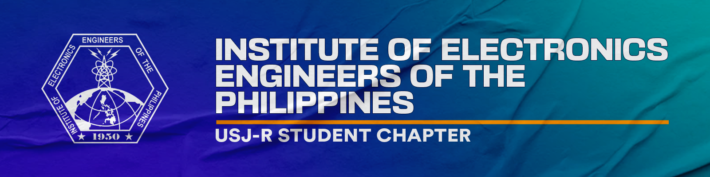

## **This is a test website for IECEP USJ-R Student Chapter.**


##### _Unfinished README.md UwU_

[](https://www.facebook.com/usjr.iecep) [](https://iecep-usj-r.github.io/iecep/) [](https://goo.gl/maps/sr2Yky2tYPuAyQob8)

----
```
Top Contributors:
Aubrey Tidoso
Sheira Maria Bermudo
Aubrey Carbonera
Christian Larr P. Absalon
```
----
### **About Us**
##### The Institute of Electronics Engineers of the Philippines - USJ-R Student Chapter is a non-profit student organization at the University of San Jose-Recoletos. The organization aims to provide its services to all Josenian ECE students and faculty.

##### This website aims to provide additional information about our organization. In this website, we will share the following: Our projects, Review Notes, Achievements, News, and Contact Info.
----

### Thank you!
